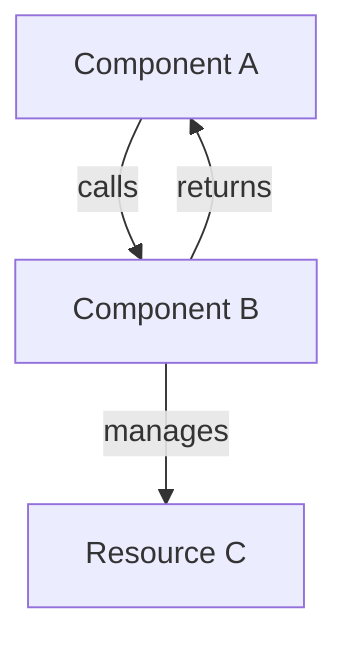

# PHASE CHARITY: DOCUMENTATION STYLE GUIDE & TEMPLATES
## XLibre Documentation Standards for Consistency and Quality

---

## DOCUMENTATION PHILOSOPHY

### Core Principles

**1. Clarity Over Brevity**
Write for understanding, not just information density. Err on the side of explanation.

**2. Inclusive Language**
Write for beginners AND experts. Define jargon. Explain context.

**3. Practical Examples**
Show working examples, not just theory. Include commands, code, and output.

**4. Platform Awareness**
Note platform-specific differences clearly. Don't assume Linux/x86.

**5. Maintenance**
Think about future updates. Use format that ages well. Link to authoritative sources, not copies.

**6. Accessibility**
Make documentation accessible to users with different abilities and backgrounds.

---

## MARKDOWN STYLE GUIDE

### File Naming
```
✓ installation-ubuntu.md
✓ graphics-drivers-nvidia.md
✓ xnamespace-api-reference.md
✓ troubleshooting-display-issues.md
✗ installing on ubuntu.md
✗ NVIDIA_DRIVERS_GUIDE.MD
```

### Frontmatter (Optional but Recommended)
```yaml
---
title: "Installing XLibre on Ubuntu"
description: "Step-by-step guide for Ubuntu and Debian systems"
author: "[Contributor Name]"
last_updated: "2026-05-15"
version: "1.0"
difficulty: "beginner"
estimated_time: "15 minutes"
---
```

### Headings
```markdown
# Main Title (H1 - one per document)
## Section (H2)
### Subsection (H3)
#### Details (H4 - rarely needed)

✓ Use only ONE h1 per document
✓ Use logical hierarchy
✗ Don't skip heading levels (#title then ####)
```

### Paragraphs
```markdown
Keep paragraphs short (2-4 sentences max). Break up long text with headings, lists, and code blocks.

✓ Use blank lines between sections
✓ Keep sentences clear and direct
✓ One idea per paragraph
✗ Wall-of-text paragraphs
```

### Lists
```markdown
Unordered lists for items without hierarchy:
- Item one
- Item two
- Item three

Ordered lists for sequential steps:
1. First step
2. Second step
3. Third step

Definition lists (when applicable):
Term
: Definition of the term

Nested lists (with caution):
- Parent item
  - Child item
    - Grandchild item

✓ Use consistent formatting
✓ Keep items parallel in structure
✗ Don't create lists deeper than 3 levels
```

### Code Formatting
```markdown
Inline code: `xrandr`, `Xserver`, `/etc/X11/xorg.conf`

Code blocks with language:
```bash
# Install XLibre on Ubuntu
sudo apt-get update
sudo apt-get install xserver-xlibre
```

```c
// C code example
int main() {
    return 0;
}
```

✓ Always specify language (bash, python, c, etc.)
✓ Include comments explaining commands
✓ Show expected output if helpful
✗ Don't paste giant blocks without context
```

### Emphasis
```markdown
**Bold** for important concepts: **do not** ignore this
*Italic* for mild emphasis: *this* is important context
***Bold italic*** for critical warnings: ***Do not do this***

✓ Use sparingly
✓ Bold for important concepts
✓ Italic for first mention of terms
✗ Don't use excessive emphasis
```

### Links
```markdown
Inline link: [XLibre GitHub](https://github.com/X11Libre/xserver)

Reference link:
[XLibre GitHub][1]
[1]: https://github.com/X11Libre/xserver

✓ Use descriptive link text
✓ Include title in reference
✗ Don't use "click here"
✗ Don't leave bare URLs
```

### Tables
```markdown
| Feature | XLibre | Alternative |
|---------|--------|-------------|
| Performance | Excellent | Good |
| Modern code | Yes | Partial |
| Community | Growing | Established |

✓ Use for comparisons and matrices
✓ Keep tables simple (not more than 5 columns)
✗ Don't use tables for layout
```

### Blockquotes
```markdown
> Important concepts can be highlighted in blockquotes
> Use for key takeaways or warnings

**Note:** Alternative to blockquote for less formal notes
**Warning:** Use for critical information
**Tip:** Use for helpful hints
**Example:** Use before code examples
```

### Images/Diagrams
```markdown


✓ Always include descriptive alt text
✓ Use Mermaid for diagrams (see below)
✓ Include image in same folder or documented folder
✗ Don't link to external images (broken links)
✗ Use generic alt text ("image1", "picture")
```

---

## CONTENT STRUCTURE TEMPLATES

### Template 1: Installation Guide

```markdown
# Installing XLibre on [Platform]

## Before You Start

- **Time:** 15 minutes
- **Difficulty:** Beginner
- **Requirements:** 
  - Root access or sudo
  - [X] GB disk space
  - Internet connection
- **What you'll need:**
  - [List any downloads]

## Prerequisites

### Check Your System

```bash
command to check prerequisites
expected output
```

### Install Dependencies

```bash
command to install deps
```

## Step-by-Step Installation

### Step 1: Add Repository (if needed)

Explanation of what this does and why.

```bash
command
```

Expected output:
```
output
```

### Step 2: Install XLibre

Explanation.

```bash
command
```

Expected output:
```
output
```

### Step 3: Verify Installation

Verify it worked:

```bash
command to verify
```

You should see:
```
expected output
```

## Configuration (Optional)

### Basic Configuration

If you need to configure:

```bash
step 1
step 2
```

### Advanced Configuration

[Link to advanced guide]

## Start XLibre

### Option 1: Using startx

```bash
startx
```

### Option 2: Using Display Manager

[Explain for your desktop environment]

### Troubleshooting

If you see error: [specific error]
Solution: [How to fix]

## Verify It Works

You should see: [What success looks like]

## Next Steps

- [Link to configuration guide]
- [Link to troubleshooting]
- [Link to usage guide]

## Getting Help

- [Link to FAQ]
- [Community channels]
- [Report issues]

---

## Additional Resources

- [Official X11 documentation]
- [Related XLibre guides]
```

---

### Template 2: Troubleshooting Guide

```markdown
# Troubleshooting: [Problem Category]

## Quick Checklist

- [ ] Is XLibre installed correctly? ([verification guide])
- [ ] Is your graphics driver installed? ([driver guide])
- [ ] Have you restarted? (Yes, really—try it)
- [ ] Is it specific to your hardware?

## Problem: [Specific Issue]

### Symptoms

What you see: [Description]

Example error message:
```
error message text
```

### Likely Causes

1. Cause A - [Explanation]
2. Cause B - [Explanation]
3. Cause C - [Explanation]

### Solution 1: [First thing to try]

This is the most common fix.

1. [Step 1]
   ```bash
   command
   ```

2. [Step 2]
   ```bash
   command
   ```

3. [Step 3] - Verify:
   ```bash
   command to verify
   ```

Expected output:
```
should see this
```

### Solution 2: [Second thing to try]

If Solution 1 didn't work:

[Steps...]

### Solution 3: [Advanced/last resort]

[Steps...]

## Gathering Diagnostic Information

If the above didn't work, gather this info for support:

```bash
# Check XLibre version
X -version

# Check Xserver log
less ~/.local/share/xorg/Xorg.0.log

# Check graphics driver
lspci | grep -i vga
glxinfo | grep -i "vendor\|renderer"
```

Paste this information when asking for help:
[Example format]

## Prevention

To prevent this issue:
- [Best practice 1]
- [Best practice 2]

## Related Issues

- [Link to similar issue]
- [Link to related FAQ]

## Still Not Working?

- Check the [FAQ]
- Search [GitHub Issues]
- Ask in [Community Chat]
```

---

### Template 3: Developer Guide

```markdown
# [Component] Architecture & Development

## Overview

[2-3 paragraph explanation of what this component does]

## Key Concepts

### Concept 1: [Important Idea]

**Definition:** [Clear explanation]

**Why it matters:** [Context and importance]

**Example:**
```c
// Code example
```

### Concept 2: [Another Important Idea]

[Repeat structure]

## Architecture Diagram



## Key Data Structures

### Structure 1: [Name]

```c
typedef struct {
    int field1;      // Description
    char *field2;    // Description
} StructName;
```

**Purpose:** [Why this structure exists]

**Fields:**
- `field1` - [Description]
- `field2` - [Description]

### Structure 2: [Another structure]

[Repeat]

## Key Functions/APIs

### Function 1: [Function Name]

```c
int FunctionName(int param1, const char *param2);
```

**Purpose:** [What it does]

**Parameters:**
- `param1` - [What it is and valid values]
- `param2` - [What it is and valid values]

**Return Value:**
- `0` - Success
- `-1` - Error (see errno)

**Example:**
```c
// How to use
int result = FunctionName(5, "value");
if (result < 0) {
    perror("FunctionName");
    return -1;
}
```

**See Also:** [Related functions]

## Code Flow Examples

### Example Flow: [Common Scenario]

When [user action]:

1. [Step 1] - [Code reference]
2. [Step 2] - [Code reference]
3. [Step 3] - [Code reference]

```
[ASCII flow diagram if helpful]
```

## Integration Points

### Extension Interface

How to write an extension for this component:

```c
// Example extension
```

### Driver Interface

How drivers interact with this component:

```c
// Example driver code
```

## Performance Considerations

- [Optimization opportunity 1]
- [Bottleneck 2]
- [Tuning parameter 3]

## Testing

### Unit Tests

[How to run tests]

```bash
# Run tests
make test
```

### Integration Tests

[How to test with full system]

### Writing Tests

[Guidelines and examples]

## Common Mistakes

1. **Mistake A** - [What people do wrong]
   ```c
   // Bad code
   wrong_approach();
   ```
   
   **Fix:**
   ```c
   // Correct code
   right_approach();
   ```

2. **Mistake B** - [Another common error]

## Contributing to This Component

- [How to propose changes]
- [Testing requirements]
- [Code review process]

## References

- [X11 Protocol Reference]
- [Related Specs]
- [Implementation Papers]
```

---

### Template 4: API Reference

```markdown
# [API Name] API Reference

## Overview

[Brief description of this API]

```c
#include <xlibre/api.h>
```

## Data Types

### Type: [TypeName]

```c
typedef [definition]
```

**Description:** [What it represents]

**Members:**
```c
typedef struct {
    int field1;      // Description
    float field2;    // Description
} TypeName;
```

## Functions

### Function: [FunctionName]

```c
ReturnType FunctionName(ParamType1 param1, ParamType2 param2);
```

**Description:**
[What the function does]

**Parameters:**

| Name | Type | Description |
|------|------|-------------|
| param1 | ParamType1 | [Description] |
| param2 | ParamType2 | [Description] |

**Return Value:**

| Value | Meaning |
|-------|---------|
| 0 | Success |
| -1 | Error (errno set) |

**Errors:**
- `EINVAL` - Invalid parameter
- `ENOMEM` - Out of memory

**Example:**
```c
ParamType1 param = initialize();
int result = FunctionName(param, value);
if (result < 0) {
    perror("FunctionName");
    return result;
}
```

**See Also:** [Related functions]

## Constants/Enums

```c
typedef enum {
    VALUE_1 = 1,    // Description
    VALUE_2 = 2,    // Description
} EnumName;
```

## Macros

```c
#define MACRO_NAME(arg) /* implementation */
```

**Purpose:** [What it does]

**Parameters:** [Parameter descriptions]

**Example:**
```c
// Usage
MACRO_NAME(value);
```

## Complete Example

```c
// Comprehensive example showing typical usage
#include <xlibre/api.h>

int main() {
    // Initialize
    // Use API
    // Clean up
    return 0;
}
```

## Thread Safety

[Is this API thread-safe? How?]

## Backward Compatibility

[Information about changes between versions]
```

---

## CONTENT STANDARDS

### Audience Definition

Always know who you're writing for:

**Beginner**: No X11 knowledge
- Define all terms
- Explain context
- Provide working examples
- Simple step-by-step

**Intermediate**: Some X11 knowledge
- Can skip basic explanations
- Focus on details and examples
- Mention related concepts
- Include alternatives

**Expert**: Deep X11 knowledge
- Focus on specifics
- Reference standards and specs
- Include technical depth
- Assume familiarity

### Tone & Voice

- **Professional** - Clear, authoritative
- **Friendly** - Welcoming, not condescending
- **Helpful** - Genuinely trying to help
- **Encouraging** - Validation for users trying to learn

**Good Examples:**
- "This might seem complex, but we'll break it down step-by-step"
- "You've installed XLibre successfully! Next step..."
- "If you see this error, don't worry—here's how to fix it"

**Bad Examples:**
- "Obviously, you should..."
- "Anyone who knows X11 would understand this..."
- "This is trivial to configure"

### Technical Accuracy

- Verify information before publishing
- Note version compatibility
- Link to authoritative sources
- Document assumptions
- Update when information changes

### Inclusivity

- Use "they/them" as default
- Explain concepts for non-native English speakers
- Avoid idioms and cultural references
- Be specific about platform support
- Include accessibility considerations

---

## REVIEW CHECKLIST

Before submitting documentation for publication:

### Content
- [ ] Is the purpose clear in the first sentence?
- [ ] Is the content accurate and current?
- [ ] Are all claims verifiable?
- [ ] Is the level appropriate for target audience?
- [ ] Are examples tested and working?
- [ ] Are platform differences noted?

### Structure
- [ ] Does it have a clear introduction?
- [ ] Is there a logical flow?
- [ ] Does it end with clear next steps?
- [ ] Is the heading hierarchy correct?
- [ ] Are sections appropriately sized?
- [ ] Is it easy to scan?

### Clarity
- [ ] Is every sentence clear?
- [ ] Are technical terms defined?
- [ ] Are there enough examples?
- [ ] Are there unnecessary jargon?
- [ ] Is passive voice minimized?
- [ ] Are instructions actionable?

### Formatting
- [ ] Is formatting consistent?
- [ ] Are code blocks properly formatted?
- [ ] Are links working?
- [ ] Are images present and relevant?
- [ ] Is there appropriate emphasis?
- [ ] Does it render correctly?

### Accessibility
- [ ] Do images have alt text?
- [ ] Is color not the only signal?
- [ ] Are headings semantic?
- [ ] Is contrast adequate?
- [ ] Can it be read by screen readers?
- [ ] Is line length reasonable?

### Inclusivity
- [ ] Is language inclusive?
- [ ] Are assumptions stated?
- [ ] Are all relevant platforms mentioned?
- [ ] Are different skill levels acknowledged?
- [ ] Are resources linked for deeper learning?

---

## COMMON PATTERNS

### Prerequisites Section

```markdown
## Prerequisites

Before starting, you'll need:
- [Requirement 1] - Why it's needed
- [Requirement 2] - Why it's needed
- [Requirement 3] - Why it's needed

To check if you have these:

```bash
# Check command 1
command1
# Should output: expected_output

# Check command 2
command2
# Should output: expected_output
```
```

### Commands & Output

Always show both command AND output:

```markdown
Run this command:

```bash
$ xdpyinfo
```

You should see output like:

```
name of display:    :1
version number:    11.0
```
```

### Warnings & Notes

Use consistent formatting:

```markdown
**Important:** This will delete data. Back up first!

**Note:** This step is optional but recommended.

**Tip:** You can skip this on newer systems.

**Warning:** Do not enable this in production environments.
```

### Next Steps

Always include at the end:

```markdown
## What's Next?

Now that you have XLibre installed, you might want to:
1. [Link to configuration guide]
2. [Link to desktop environment guide]
3. [Link to troubleshooting if issues]
```

---

## FILE ORGANIZATION

```
docs/
├── README.md
├── STYLE-GUIDE.md (this file)
├── TEMPLATES/
│   ├── installation-guide-template.md
│   ├── troubleshooting-template.md
│   ├── developer-guide-template.md
│   └── api-reference-template.md
├── IMAGES/
│   ├── architecture-diagram.png
│   ├── screenshot-xrandr.png
│   └── flow-diagram.svg
└── [other content directories]
```

---

## GETTING HELP

When writing documentation:

1. **Unsure about accuracy?** Ask in #xlibre-docs-help
2. **Need code example?** Link to GitHub source or ask maintainer
3. **Struggling with structure?** Review relevant template
4. **Want feedback?** Post draft in discussion before finalizing
5. **Technical question?** Escalate to subject matter expert

---

## REVISION PROCESS

### Before Publishing

1. Write first draft
2. Self-review using checklist
3. Submit to workstream for peer review
4. Make revisions based on feedback
5. Technical review (if needed)
6. Final proofread
7. Merge to main branch

### After Publishing

- Monitor for questions/issues
- Fix errors promptly
- Update for version changes
- Collect feedback for improvement

---

This style guide ensures all XLibre documentation is clear, accurate, consistent, and accessible. Questions? Ask in the community channels!

